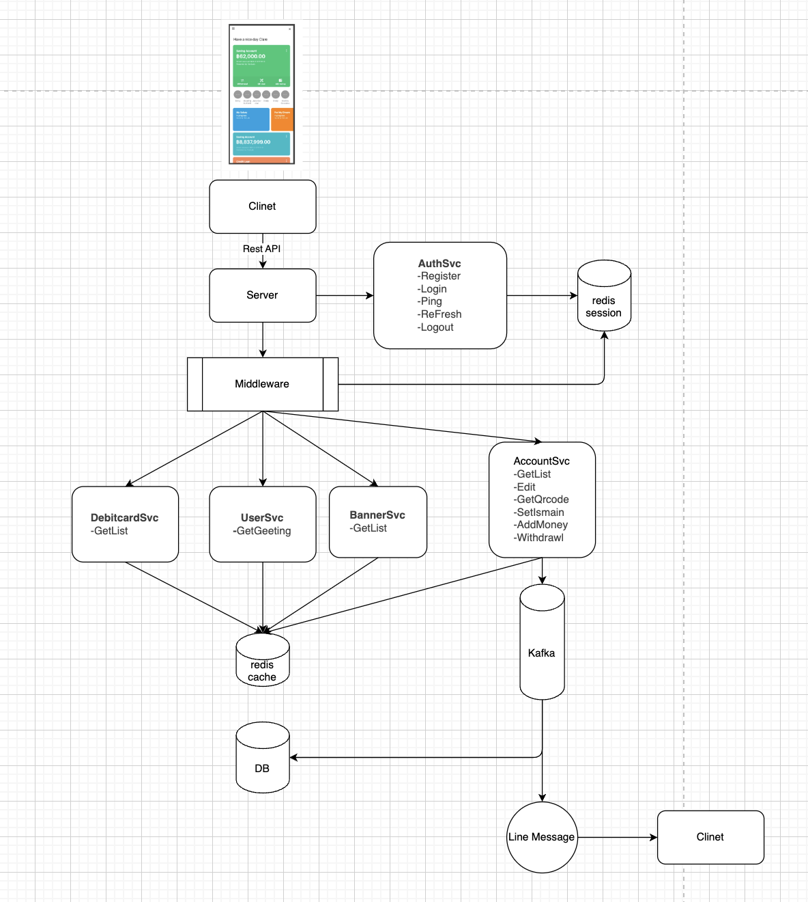
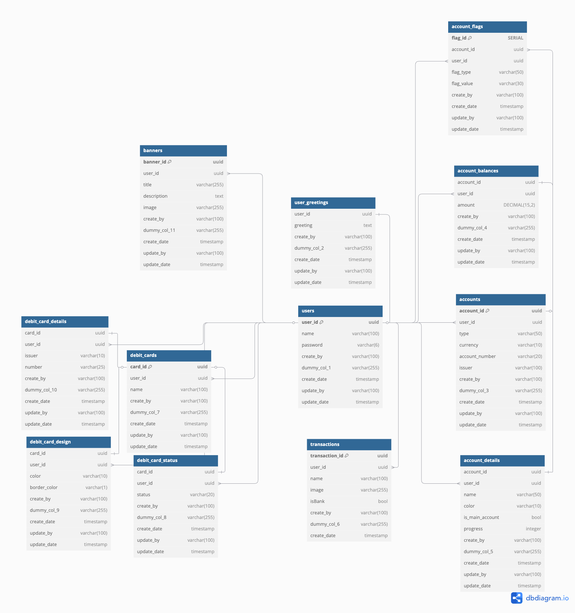

# go-bank
<h1></h1>

<h2>Flow Diagram</h2>

<h2>ER Diagram</h2>

<h2>Tech stack</h2>

- [x] [Design Pattern >> Hexagonal Architecture]
- [x] [Web Server Framwork >> fiber/v2]
- [x] [Database >> PostgreSQL]
- [x] [Cache >> Redis]
- [x] [Queue >> Kafka]
- [x] [Notification >> Line Message]
- [x] [Test API >> K6]

