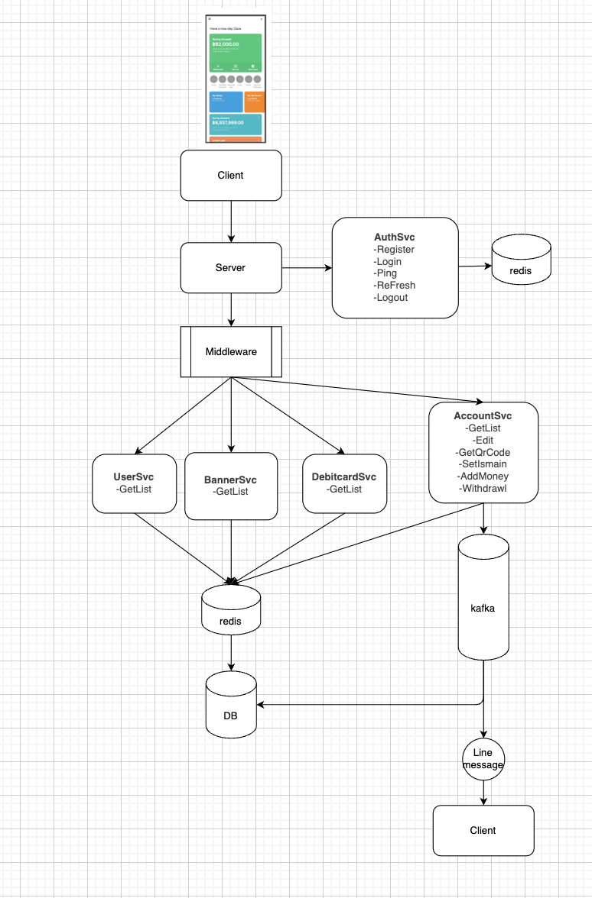

# go-bank
<h1></h1>

<h2>Flow Diagram</h2>


<h2>ER Diagram</h2>


<h2>Tech stack</h2>

- [x] [Design Pattern >> Hexagonal Architecture]
- [x] [Web Server Framwork >> fiber/v2]
- [x] [Database >> PostgreSQL]
- [x] [Cache >> Redis]
- [x] [Queue >> Kafka]
- [x] [Notification >> Line Message API]
- [x] [Test API >> K6]


<h2>Setup Project</h2>

```bash
# images
docker pull redis
docker pull postgres
docker pull confluentinc/cp-zookeeper:7.5.0
docker pull confluentinc/cp-kafka:7.5.0

# env for Line Message API
LINE_ACC_TOKEN = <your token>
LINE_USER_ID_TOKEN = <your token>


# start container
docker-compose up -d
# stop container
docker-compose down
```


<h2>Run Start Project Command</h2>

```bash
# initial
go mod tidy

#create table databaes and simple data (admin)
go run ./cmd/task/create .  

# inset admin data
go run ./cmd/task/insert .  

# inset mock data of banner (2M data) for test performance
go run ./cmd/task/insert-mock .  

# run server
go run ./cmd/api .  
```

<h2>Spec API Swager JSON</h2>

- [x] [http://localhost:8080/swagger/index.html#]


<h2>Run unit test for business logic</h2>

```bash
#my coverage > 80
 go test ./internal/... -coverprofile=coverage.out && go tool cover -func=coverage.out 
```

<h2>Run Test K6 api of simple data 20M (banner) </h2>

```bash
# first without redis cache
 docker run --rm -v ./scripts:/scripts grafana/k6 run /scripts/test.js

#  seconed with redis cache
 docker run --rm -v ./scripts:/scripts grafana/k6 run /scripts/test.js
```